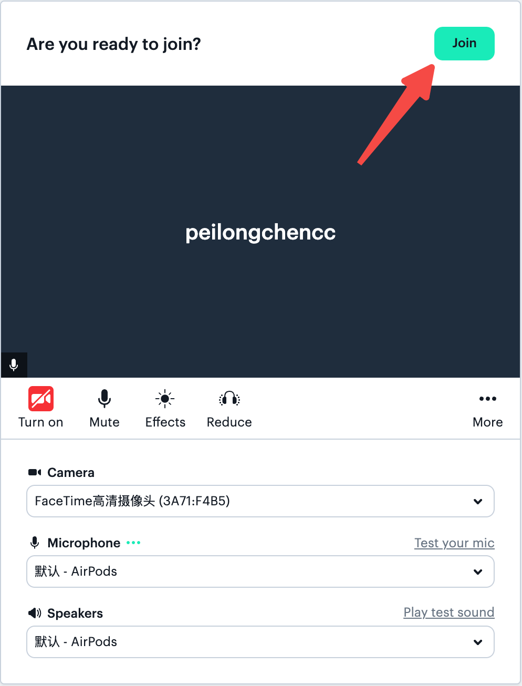
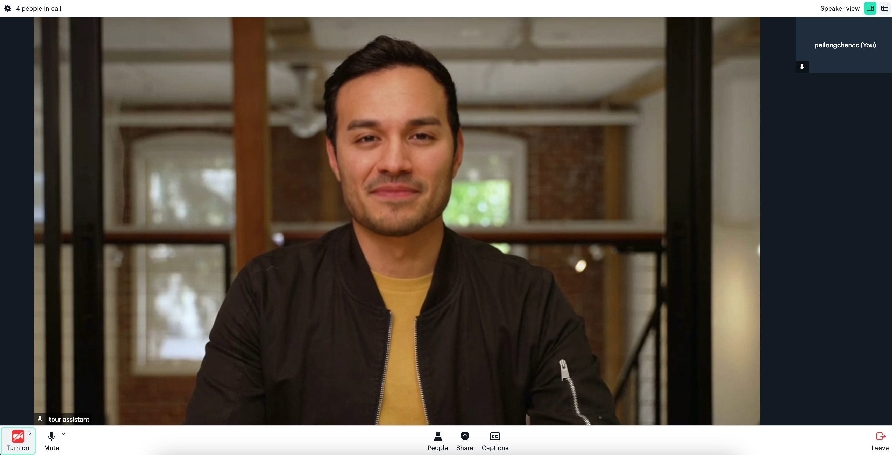

# My-Daily_Python

以[Daily](https://www.daily.co/)的Python SDK为基，监听[Tavus](https://www.tavus.io/)服务中人物会话信息。

- [My-Daily\_Python](#my-daily_python)
  - [Tavus和Daily简介：](#tavus和daily简介)
    - [Tavus体验:](#tavus体验)
  - [项目前言:](#项目前言)
    - [测试连接Daily服务:](#测试连接daily服务)
  - [系统配置信息:](#系统配置信息)
  - [代码环境配置:](#代码环境配置)
    - [Conda环境配置:](#conda环境配置)
    - [依赖项安装:](#依赖项安装)
  - [主程序运行:](#主程序运行)
    - [1. 创建Tavus会议:](#1-创建tavus会议)
    - [2. 根据conversation\_url入会:](#2-根据conversation_url入会)
    - [3. 启动websocket服务:](#3-启动websocket服务)
    - [4. 建立websocket连接:](#4-建立websocket连接)
  - [接口详解:](#接口详解)
    - [接口调用前提:](#接口调用前提)
    - [开始监听:](#开始监听)
    - [结束监听:](#结束监听)
    - [数据返回格式:](#数据返回格式)

## Tavus和Daily简介：

Tavus 是一个专注于**个性化视频生成、虚拟人交互**的平台。

Daily 是一个**实时视频和音频通信**的 API 服务提供商，类似腾讯会议。不过，Daily 更加注重开发者友好和API 接入，而腾讯会议则是一个面向终端用户的完整产品。

Tavus现和Daily合作，虚拟人服务搭建在了Daily会议中，用户可在Daily会议中和虚拟人实时交互。

### Tavus体验:

读者可运行项目根目录的 `tavus` 文件体验一下与数字人交互。操作顺序如下:

1. 创建Tavus账号，[获取API-KEY](https://platform.tavus.io/api-keys)。

2. 终端运行 `tavus_replica_create.py` 配置tavus虚拟人认知能力。

3. 终端运行 `tavus_conversation_create.py` 创建Tavus对话。

🚨注意: 请读者根据自身情况决定是否升级Tavus服务，笔者使用Daily、Tavus仅用于研究/学习，不作任何推荐。

毕竟，Tavus还是比较贵的。如果只用于测试，免费版的三分钟也足够用了。


## 项目前言:

**代码环境/服务器** 必须能以socket5形式连接到Daily才能运行监听Tavus服务中人物会话信息。

> 笔者为了方便直接租用了AWS服务器，省去了配置科学上网的功夫，可以直接连接到Daily服务。

### 测试连接Daily服务:

测试方法很简单，运行 `main.py` 后查看入会成员是否有代码中定义的 "listener" 角色即可。

注意: 即使你没有连接到会议，Daily的代码也不会报错。不报错，不代表你连接到了Daily会议室。


## 系统配置信息:

- 服务器: AWS服务器，支持连接Daily。
- 系统: ubuntu 24.04


## 代码环境配置:

### Conda环境配置:

```bash
conda create -n daily_py python==3.10.15
conda activate daily_py
```

### 依赖项安装:

```bash
pip install -r requirements.txt
```


## 主程序运行:

### 1. 创建Tavus会议:

```bash
# 创建tavus会议
python tavus_conversation_create.py
```

终端输出:

```json
{
    "conversation_id": "c7f4816e",
    "conversation_name": "\u65c5\u6e38\u52a9\u624b",
    "conversation_url": "https://tavus.daily.co/c7f4816e",
    "status": "active",
    "callback_url": null,
    "created_at": "2024-10-24T02:25:36.053Z"
}
```

### 2. 根据conversation_url入会:

根据 `conversation_url` 对应的网址参加会议，效果如下:





### 3. 启动websocket服务:

```bash
python main.py
```

### 4. 建立websocket连接:

通过Apifox建立连接，发送请求进行监听。


## 接口详解:

### 接口调用前提:

1. 创建 tavus 会议并入会。
2. 与 `ws://18.xxx.xxx:8000/ws` 建立连接。

### 开始监听:

传入tavus会议的`conversation_id`至ws链接，正式开始监听 **会议室人物所说文本信息**。传入数据类型为字符串，格式如下:

```txt
conversation_id:c70ed8f4
```

开始监听后，不需传入任何内容，程序会自动回传数据。注意：tavus会议结束后，记得**结束监听**。

### 结束监听:

传入字符串结束监听，格式如下:

```txt
disconnect
```

### 数据返回格式:

默认返回字符串形式，前端使用时可根据需要转换为json格式。

> tavus返回的信息**不区分具体的说话人**，只区分user(用户)和replica(虚拟人)。例如张三、李四的role统一为user。

- user(用户):

```json
{
    "properties": {
        "role": "user",
        "speech": "夏天了 夏天如何 "
    },
    "conversation_id": "c70ed8f4",
    "event_type": "conversation.utterance",
    // 如果开启vqa，会有这个字段的描述
    "visual_context": "The image shows a person wearing a purple shirt, looking down. The background is plain and light-colored.",
    "message_type": "conversation"
}
```

- replica(虚拟人):

```json
{
    "conversation_id": "c70ed8f4",
    "message_type": "conversation",
    "properties": {
        "speech": "夏天的坡峰岭还是很漂亮的，满山的黄栌花开放，景色",
        "role": "replica"
    },
    "event_type": "conversation.utterance"
}
```

⚠️注意：replica会出现依次返回多条数据的情况，replica**说的内容**会以后续返回的内容讲话。建议如果连续多个信息是同一role，界面展示时，就顶掉之前的内容。

```json
{
    "message_type": "conversation",
    "conversation_id": "c70ed8f4",
    "properties": {
        "role": "replica",
        "speech": "夏天的坡峰岭绿意盎然，气温舒适，是个放松心情、享受自然的好去处。沿途的山花也会给旅行增添不少乐趣。你计划待多久呢？"
    },
    "event_type": "conversation.utterance"
}
```
